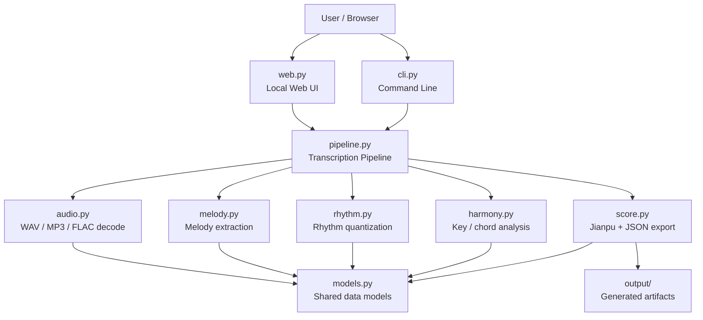

# Project Structure



## Main Folders

- `src/music_stuff/`: application source code
- `tests/`: unit and smoke tests
- `output/`: generated UI uploads, Jianpu files, analysis JSON, and logs
- `doc/`: project notes and diagrams

## Main Flow

```text
audio upload/input
  -> decode audio
  -> extract melody
  -> quantize rhythm
  -> estimate key
  -> export Jianpu and analysis JSON
  -> show/download in Web UI
```
